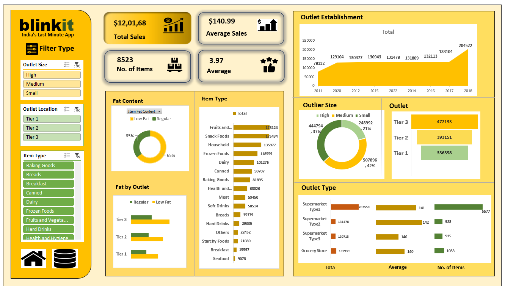

# 📦 BlinkIT Grocery Data Analysis

An Excel-based data analytics project analyzing sales and trends from BlinkIT's grocery dataset. The project provides business insights into customer preferences, sales performance, and product trends.

---

## 🎯 Objective

To analyze BlinkIT grocery sales data to extract actionable insights on product performance, customer preferences, and operational efficiency using Excel and optionally Python or Power BI.

---

## 📄 Description

This dataset contains transactional data of grocery products sold via BlinkIT. It includes details such as:
- Product names
- Categories
- Quantities sold
- Prices
- Total sales amounts

The project focuses on transforming this raw data into meaningful visualizations, pivot tables, and dashboards for strategic decision-making.

---

## 📊 Key Performance Indicators (KPIs)

- 🛒 **Top-Selling Products**
- 💸 **Total Revenue by Category**
- 📈 **Average Order Value (AOV)**
- 🧺 **Product Category Contribution**
- 📦 **Monthly/Weekly Sales Trends**
- 🚚 **Order Volume Over Time**

---

## 🛠 Tools & Technologies Used

-Microsoft Excel (Power Query, Pivot Tables, Charts, Conditional Formatting)

-Data Cleaning & Transformation using Excel formulas

-Dashboard UI Design with Excel visual elements

---

## Sample Output

## 🔍 Features

- Dynamic pivot tables for KPI monitoring
- Visual charts (bar, pie, line) for trends and distribution
- Conditional formatting for easy spotting of anomalies
- Ready to extend with Power BI or Python scripts

---

## 📈 Project Insights

- Identified **top 10 performing products** by revenue and quantity sold
- Discovered **underperforming categories** with low turnover
- Recognized **seasonal trends** in product purchases
- Found **correlation between price range and demand**

---

## ✅ Conclusion

This project demonstrates the effectiveness of Excel as a powerful tool for retail data analytics. It also lays the foundation for integrating business intelligence tools like Power BI or Python for more advanced, automated dashboards. Future enhancements could involve predictive analytics or integration with web-based apps for real-time monitoring.

---
